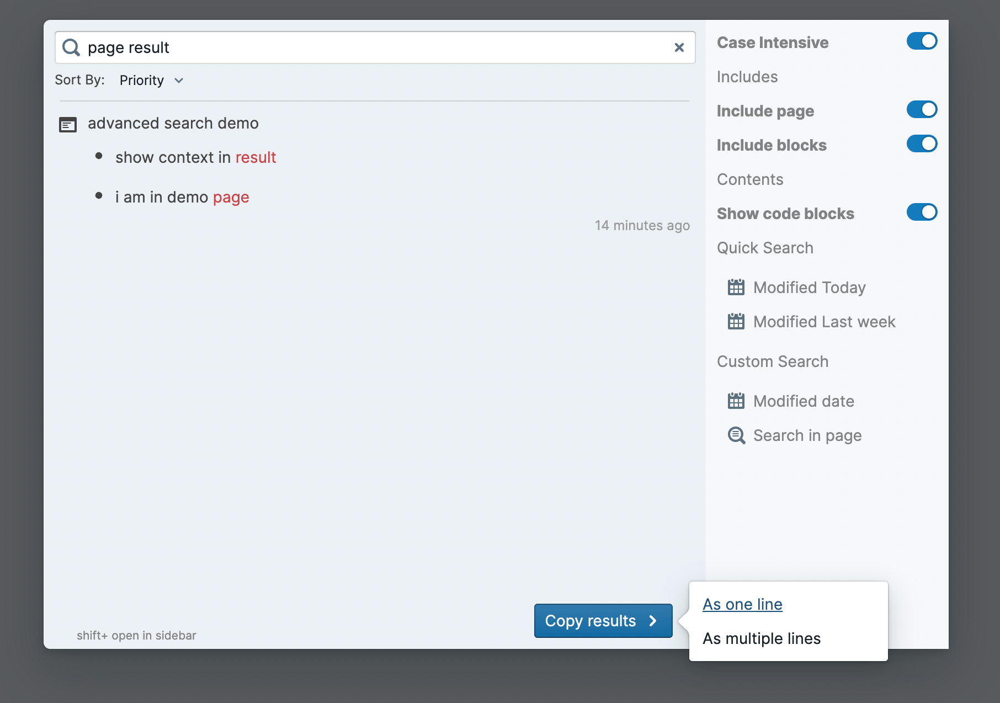

# Roam search+

> Search keywords do not need to be in a block

## Features

- search within specific pages
- search within a specific time range
- sort by 
  - priority: page title, block, keywords
  - modified time
  - created time
- supports "expressions in quotes" and case intensive
- supports copy result as references
- open in main window or sidebar
- record your queries and browsing history

## Usage

You can open the search dialog in two ways

- click in sidebar menu 

- ctrl + shift + p

## TODO

- [x] more accurate context
- [x] users involve
- [ ] multiple choice
- [ ] tags involve
- [ ] RegExp search
- [ ] panel settings
- [ ] save inputs as config like tab
- [ ] arrow key to select
- [ ] resistance to typos
- [ ] toggle Exactly
